# Allium58无线矮轴分体键盘制作过程

本仓库记录从零开始制作一把分体键盘的过程，作为自己制作第一把键盘的记录，也希望能给像我一样刚接触客制化键盘的新人一份参考。

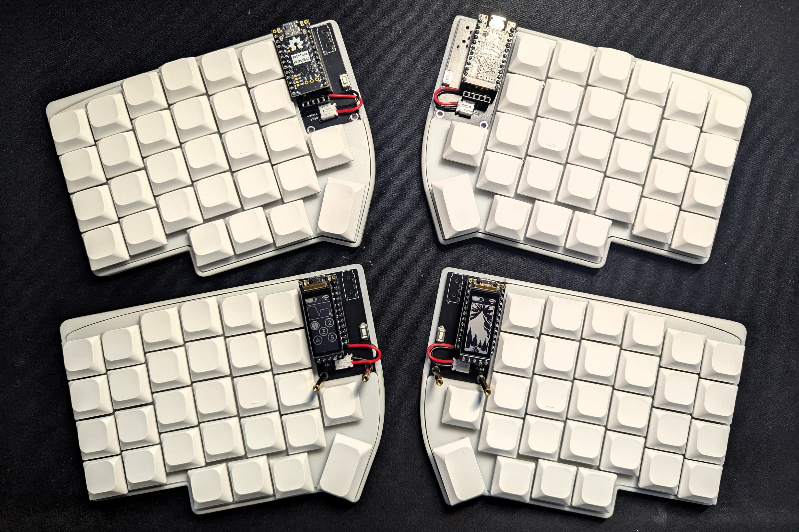

---
## 1. 选择适合的开源项目

每个人对于键盘的需求因人而异，前期可以参考这个仓库[awesome-mechanical-keyboard](https://github.com/Keycapsss/awesome-mechanical-keyboard)来选择适合自己的开源方案，这里也提一下我为什么选择[Allium58](https://github.com/beekeeb/Allium58)：
1. **分体**：选择制作分体键盘的初衷是改善肩膀的疼痛感，实际使用下来也确实做到了这一点，分体键盘可以根据自己的肩宽来放置键盘的位置，有效减少了我的颈部、肩部和腰部的疲劳感
2. **无线**：很多分体键盘是以有线方案为主，比如[dactyl-keyboard](https://github.com/tshort/dactyl-keyboard)，[redox-keyboard](https://github.com/mattdibi/redox-keyboard)，[Lily58](https://github.com/kata0510/Lily58)等，但作为一个无线设备的忠实用户，必然要选择无线优先的方案
3. **矮轴**：正常的机械键盘轴体比较高，需要搭配腕托使用，而矮轴不需要腕托就可以用更自然的手腕姿势来打字，更加的“人体工学”
4. **键位**：有些键盘的键位极为极简，比如3x6配列的[Corne keyboard](https://github.com/foostan/crkbd)，但我个人有很高频的fn，字符等的输入，所以希望键位尽可能的多。

综合以上的要求，我最终选择了[Allium58](https://github.com/beekeeb/Allium58)，一个基于[Lily58](https://github.com/kata0510/Lily58)的6*4+4配列的无线分体键盘方案，相对于Lily58，增强了无线功能，以及增加了对矮轴键盘的兼容性。

# 物料清单

[Allium58](https://github.com/beekeeb/Allium58)的README有列出制作键盘所需的BOM，但是有些物料的具体型号参数并没有详细表明，实际采购的时候踩了一些坑，我这里把BOM更详细的列出，希望能有帮助：

| 名称                             | 数量        | 备注                                                                                                                                          |
|:-------------------------------|:----------|:--------------------------------------------------------------------------------------------------------------------------------------------|
| PCB                            | 1套        |                                                                                                                                             |
| 外壳                             | 1套  | 可以3D打印                                                                                                                                      |
| 屏幕保护                           | 2         | 亚克力                                                                                                                                         |
| Promicro NRF52840或者nice!nano   | 2         |                                                                                                                                             |
| 复位开关                           | 2         | 两脚 3*6*4.3MM 微动开关/轻触开关                                                                                                                      |
| 二极管                            | 58        | 贴片 1N4148W 1206/SOD-123 丝印T4 150MA 75V开关二极管                                                                                                 |
| 矮轴热插拔轴座                        | 58        | 佳达隆矮轴热插拔轴座GATERON                                                                                                                           |
| 矮轴                             | 58        | Gateron佳达隆矮轴2.0                                                                                                                             |
| 键帽                             | 58        | 1u 56个, 1.5u 2个 [GLP Keycaps对比](https://showcase.beekeeb.com/the-keycaps-of-gateron-low-profile-key-switches-and-kailh-choc-v1-key-switch/) |
| 双通六角铜柱螺母柱M2 5mm                | 10 | 用于外壳组装                                                                                                                                      |
| 双通六角铜柱螺母柱M2 9mm                | 4  | 用于屏幕保护                                                                                                                                      |
| 304不锈钢沉头机丝十字加长平头螺丝 M2 4mm      | 28 |                                                                                                                                             |
| 贴片拨动开关                         | 2         |                                                                                                                                             |
| PH2.0弯针插座接插件                   | 2         |                                                                                                                                             |

---
# PCB
PCB推荐到嘉立创进行打印，对比过几家的价格，嘉立创是最便宜的，PCB打印最低5片，总共价格是128元左右。Allium的仓库中有使用KiCad制作的PCB工程文件，但是要注意的是，国内的打印PCB是不支持提供KiCad的工程文件，需要自己转成Gerber文件，这里推荐使用KiCad中的嘉立创扩展插件来转换成对应的Gerber文件，如果想偷懒可以直接使用我已经生成好的两个[Gerber文件](./pcb)。
然后在嘉立创下单中心中提交转换好的两个Gerber文件（左侧和右侧各一个Gerber的zip压缩包），板子数量选择5，其他使用默认即可，不过阻焊层我个人喜欢黑色的，这就因人而异了。在右侧可以实时看到PCB的3D效果图，确保文件没有问题。另外，推荐下单的时候跟客服说在生产前要确认下生产稿，尽可能做到万无一失。

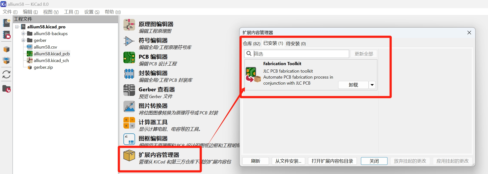

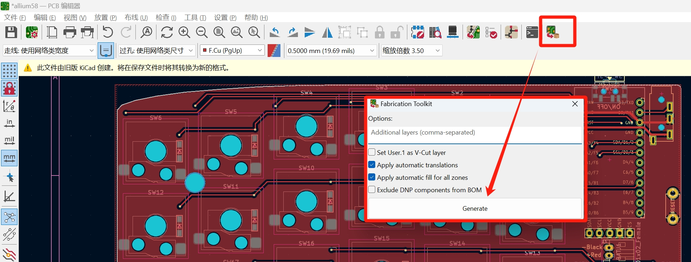

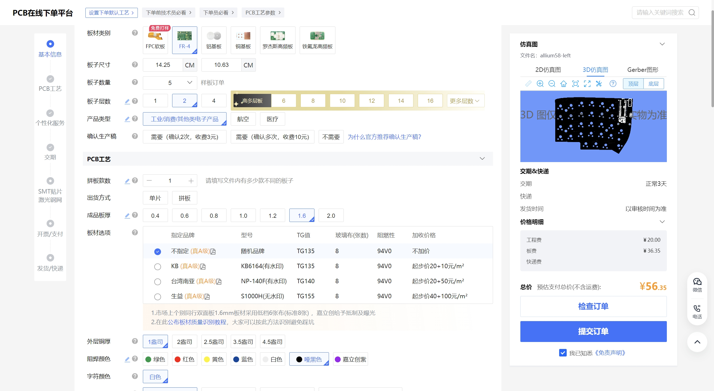

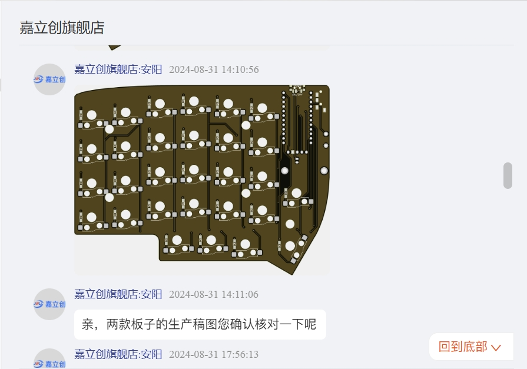

---
## 外壳
外壳的3d打印文件可以在[这里找到](https://www.printables.com/model/657755-low-profile-case-for-allium58-glp)，要注意的是里面只提供了左右其中一侧的3d打印文件，在找商家下单的时候一定要强调要给3d打印文件做一份镜像，这样才能是完整的左右各一个的整套外壳。材料推荐使用树脂，颜色可以选择白色和黑色，一套的白色价格大概50，黑色80，如果打印的数量多，比如我打印了三套白色的，价格是122，如果是黑色的价格是200元。
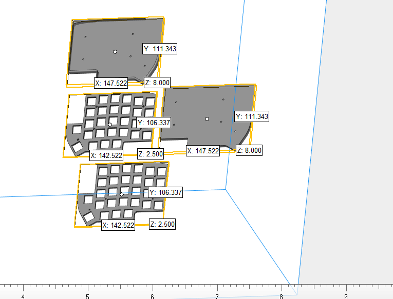

---
## 焊接&组装
焊接是整个制作中最重要的过程，推荐要有一台万用表来进行测试焊接效果。焊接时优先焊接贴片元件，比如二极管，复位开关，拨动开关等，其次是热插拔轴座，最后是排针插座。

焊接贴片元件前，可以先在焊盘的一侧上满锡，然后焊接好元件的一侧后，再焊接另一侧，此方法适用于二极管和热插拔插座：

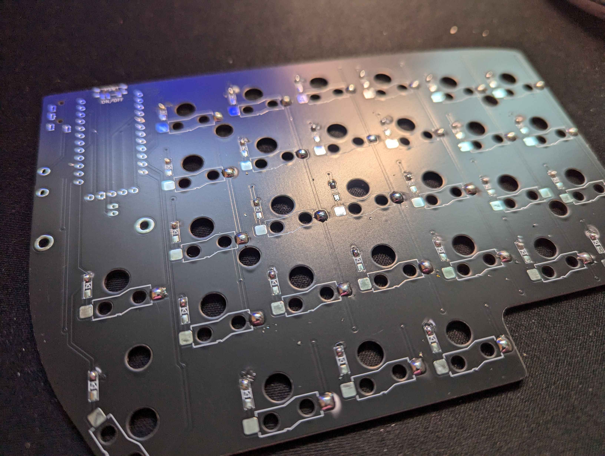

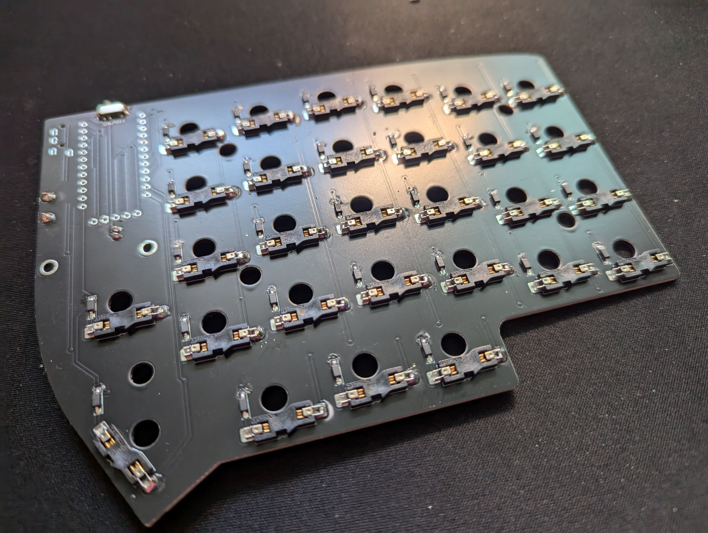

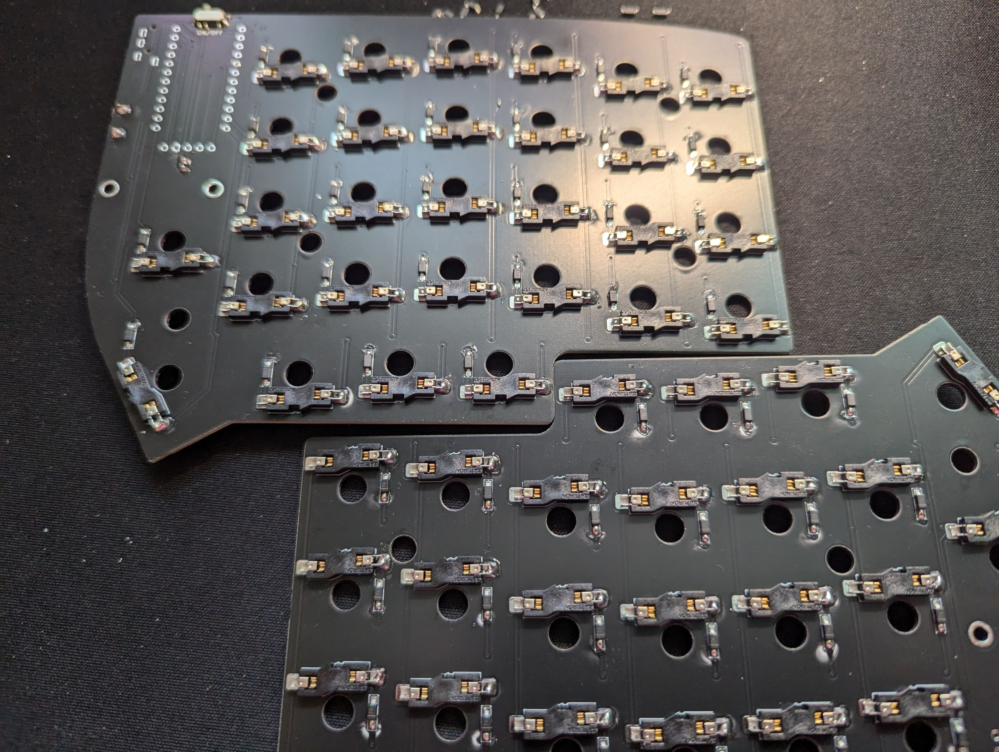

焊接的时候一定要仔细检查有没有虚焊的情况，比如下图标注的二极管的正极就有虚焊，在实际测试中这个按键不灵：
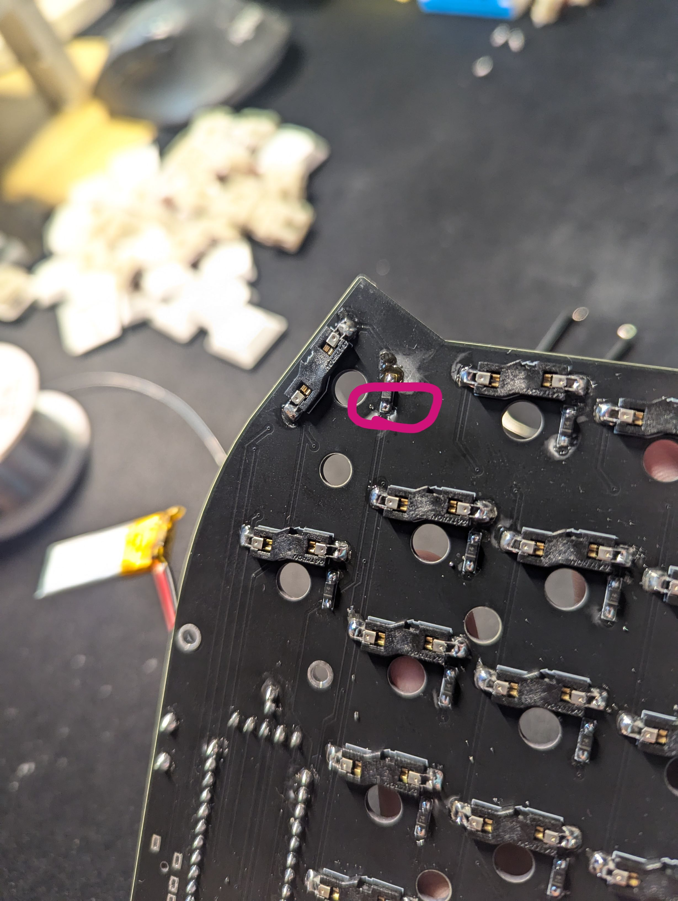

所有元件都焊接好以后，不建议直接就安装外壳，然后再安装轴体和键帽，因为一旦有按键不正常，就需要全部拆下来重新排查，我建议可以先在不安装外壳的情况下，先把轴体安装在pcb上，然后烧录固件，连接电脑测试一下各个按键的效果，这里建议使用一些[Keyboard Tester](https://www.keyboardtester.com/tester.html)来测试各个按键的效果：

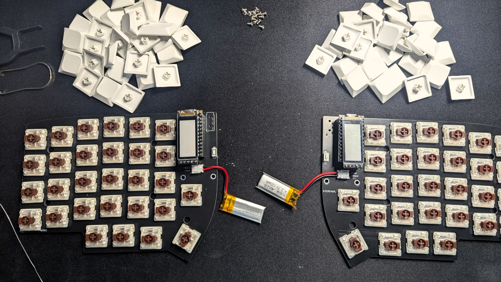

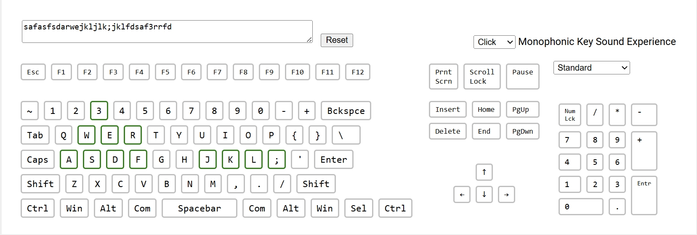

---
## 固件烧录

键盘固件使用的是[ZMK Firmware](https://zmk.dev/)，相比于QMK等固件方案，ZMK原生支持蓝牙连接，可以实现真正的无线键盘体验。而且ZMK已经包含了Lily58的预配置文件，再配合可视化配置ZMK按键映射的开源项目：[keymap-editor](https://github.com/nickcoutsos/keymap-editor)，可以非常容易的配置适合自己的按键方案。这里也放出我的按键方案，因为我是一个vim用户，按键也更倾向于适用vim的使用习惯：[allium58-zmk-config](https://github.com/jasonjiaox/allium58-zmk-config)。
这里只强调一个配置项，因为我做了两把键盘，因此需要对设备名称做一下区分，可以使用：`CONFIG_ZMK_KEYBOARD_NAME="device name"`来区分设备。

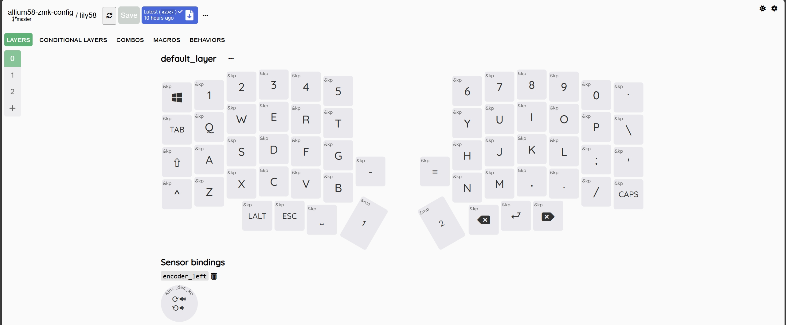

---
## 打字测试

烧录好固件后，按照一个常规的蓝牙键盘的连接方法去连接键盘即可，第一次上手分体键盘肯定要有一个适应的过程，毕竟键盘布局跟传统的键盘有了很大的差别，这里建议使用一些打字软件来熟悉一下键位，比如[monkeytype](https://monkeytype.com/)。

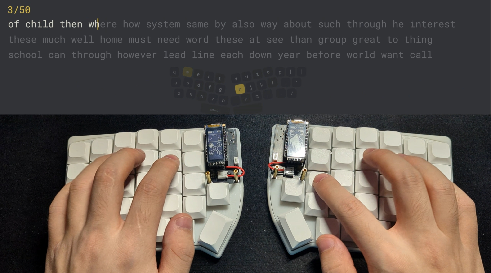

---
## 最后
从决定做一把无线分体键盘，调研各个开源项目，到最后做出成品总共花费了我大概两周的时间，然后又花了一周的时间才慢慢熟悉键位，学习成本有点类似刚上手vim一样的陡峭，但是一旦熟悉了之后，整个打字体验跟之前有了质的提升。最重要的是用了分体键盘，我能够把我的肩膀打开，身体也会自然的向座椅上靠，而不是之前身体不自觉的前倾而导致的颈椎和肩部的疼痛感。
这把分体键盘实实在在的改善了我的打字体验和健康状况，也希望当你拥有一把分体键盘的时候，也能感受到自己制作一把键盘的快乐以及人体工学的舒适，祝好~